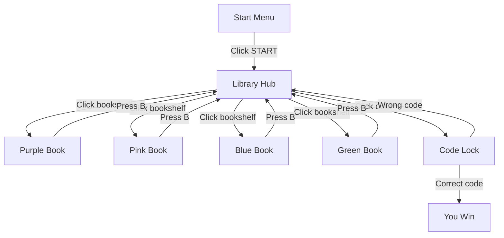

# Cube Escape Library

**An interactive escape-room style puzzle game built in C++ with OpenGL/GLUT — texture-mapped scenes, book puzzles, and a final code-lock challenge.**

---

## Table of Contents
- [Overview](#overview)
- [Scene Flow](#scene-flow)
- [Controls](#controls)
- [Key Features](#key-features)
- [Tech Stack](#tech-stack)
- [Author](#author)

---

## Overview

The player wakes up in a locked library and must explore four books scattered across the shelves, each hiding part of a secret code. Once all the clues are found, the player enters the 4-digit code at the library's door lock to escape — get it wrong, and it's back to searching the shelves.

## Scene Flow

**How it works:** The `scene` variable (0–6) drives everything the game renders and how it responds to input. Scene 0 is the start menu, scene 1 is the library hub with six clickable hitboxes (four books, a door, and an instruction note), scenes 2–5 are the individual book puzzles, and scene 6 is the final code-lock. Mouse clicks on the library hub jump directly to the relevant scene; the `B` key always returns to the library from a book or a failed code attempt.

## Controls

| Key / Action | Effect |
|---|---|
| Left Click | Interact with hitboxes (start button, books, door, instructions) |
| `C` / `c` | Open / close the book in the current scene |
| `B` / `b` | Go back to the library hub |
| `0`–`9` | Enter a digit at the door code lock |
| `Backspace` | Delete the last entered digit |
| `Enter` | Submit the code |
| `L` / `l` | Zoom in on the instruction note / rotate the win balloon |
| `S` / `s` | Zoom out on the instruction note |

## Key Features

- 7 interactive scenes with real-time mouse and keyboard-driven navigation
- Custom BMP texture loader (parses BMP headers directly, no external image library)
- Six precisely mapped hitboxes for object interaction within the library hub
- Hand-built curved page rendering for each book, with per-book color gradients
- A 4-digit code-entry lock with win/fail states and a celebratory balloon animation on success
- Zoomable in-game instruction paper for player guidance

## Tech Stack

`C++` · `OpenGL` · `GLUT` · `2D Graphics Programming` · `Event Handling` · `BMP Texture Loading`

## Skills Demonstrated

- **Graphics Programming** — rendering 2D primitives, textures, and custom curved shapes directly with OpenGL
- **Event-Driven Programming** — handling real-time mouse and keyboard input to drive game state
- **State Management** — controlling scene transitions and game logic through a central state variable
- **File I/O & Binary Parsing** — reading and parsing raw BMP image headers to load textures without external libraries
- **Procedural Animation** — coordinate-based motion (curved page rendering, balloon animation) without an animation engine
- **Problem Solving & Game Logic Design** — designing a puzzle flow with win/fail conditions and hitbox-based interactions

## Author

**Wajd Sameer Al Luhaybi**
Computer Science Student | Data Analysis & Software Development

